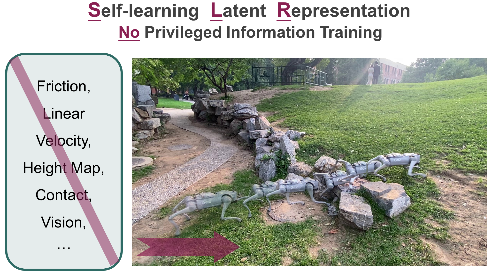

## SLR: Learning Quadruped Locomotion without Privileged Information

Official Implementation for [SLR: Learning Quadruped Locomotion without Privileged Information](https://11chens.github.io/SLR/).

<div align="center">    </div>

### 🌟 2024 Conference on Robot Learning

This codebase is licensed under the [CC BY-NC 4.0 license](https://creativecommons.org/licenses/by-nc/4.0/deed.en), with inherited licenses from [Legged Gym](training/legged_gym) and [RSL RL](training/rsl_rl) by _ETH Zurich, Nikita Rudin_ and _NVIDIA CORPORATION & AFFILIATES_. Commercial use of the material is prohibited.

Please read through the entire README before cloning the repo.

---

### 🛠️ Getting Started

#### 🚀 Pipeline to Install and Train SLR

**Note**: Before running our code, it's highly recommended to first familiarize yourself with the [RSL's Legged Gym version](https://github.com/leggedrobotics/legged_gym) to get a basic understanding of the Isaac-LeggedGym-RslRL framework.

---

#### 1. Create an environment and install PyTorch

```bash
conda create -n slr python=3.8
conda activate slr
pip install torch==2.4.1 torchvision==0.15.3 torchaudio==2.0.2
```

---

#### 2. Install Isaac Gym (Preview 4 release)

Download and install from [Isaac Gym](https://developer.nvidia.com/isaac-gym):

```
cd isaacgym/python && pip install -e .
```

Test the installation by running an example:

```
cd examples && python 1080_balls_of_solitude.py
```

---

#### 3. Clone this repository and install packages:

```
git clone git@github.com:11chens/SLR-master.git
```

Ensure you have installed the following packages:

```
pip install .

```

---

#### 4. Try Training the Model

You can use the `--headless` flag to disable the GUI. Press "v" to pause/resume GUI playback.

```
python train.py
```

---

#### 5. Play the Trained Policy

```
python play.py
```

---

### 📑 Citation

If our work has helped you, please consider citing the following:

```
@inproceedings{
chen2024slr,
title={{SLR}: Learning Quadruped Locomotion without Privileged Information},
author={Shiyi Chen and Zeyu Wan and Shiyang Yan and Chun Zhang and Weiyi Zhang and Qiang Li and Debing Zhang and Fasih Ud Din Farrukh},
booktitle={8th Annual Conference on Robot Learning},
year={2024},
url={https://openreview.net/forum?id=RMkdcKK7jq}
}
```

---

### 👏 Acknowledgements

This project leverages components from several amazing open-source repositories:

- [Legged Gym](https://github.com/leggedrobotics/legged_gym)
- [RSL RL](https://github.com/leggedrobotics/rsl_rl)
- [Isaac Gym](https://developer.nvidia.com/isaac-gym)
- [LocomotionWithNP3O](https://github.com/zeonsunlightyu/LocomotionWithNP3O)

Thanks to the authors and contributors for their work!
